# Final Report: EEC scRNA-seq Course Project

## Study Overview and Methods

This study analyzes six endometrium scRNA-seq samples (EEC and normal controls) under a unified QC framework and a strict intersection definition of retained barcodes. We completed the full pipeline from SRA download through Cell Ranger, CellBender, scDblFinder, and Seurat/SingleR, followed by clustering and annotation on the Isec-intersection cell set. In total, 37,470 intersected cells were retained, with an average doublet rate of 9.33% and a stable median mitochondrial fraction across samples (3.85%–6.30%). Beyond automated annotation, we built a manual-annotation evidence chain using marker FeaturePlot and heatmaps to validate major cell types. Overall, Disease samples were enriched for epithelial cells, whereas Control samples were dominated by fibroblasts, with a higher immune-cell proportion in Disease. This report provides the QC summary table, per-sample QC plots, doublet UMAPs, clustering and annotation UMAPs, and manual-annotation evidence, in line with course requirements.

EEC (endometrioid endometrial carcinoma) and normal endometrium differ markedly in cellular composition and microenvironment. Single-cell transcriptomics enables cell-type-level resolution of these differences. Following the course specification, we processed six samples with standardized steps and provide an initial interpretation of cell-type composition and group-level shifts.

The dataset is PRJNA786266 / SRP349751. Group labels were derived from `meta/SraRunTable.csv`: Disease (SRR17165223, SRR17165224, SRR17165229) and Control (SRR17165227, SRR17165230, SRR17165231). After SRA download and FASTQ conversion, quantification was performed with Cell Ranger. Background removal used CellBender remove-background (model=full, epochs=150, fpr=0.01). Doublet detection was performed with scDblFinder, with QC filtering at this stage using consistent thresholds: percent.mt <= 15%, UMI >= 500, genes >= 200, and adaptive upper bounds of UMI <= min(MAD_high_log10, Q99.5, 80000) and genes <= min(MAD_high_log10, Q99.5, 11000). The Isec intersection was defined as Cell Ranger filtered barcodes intersected with CellBender cell_barcodes, scDblFinder singlets, and QC-passed barcodes.
All code and figures are available in the GitHub repository: https://github.com/Pyramtee/EEC-scRNA-Isec6.

Seurat SCTransform was applied to Isec cells, followed by PCA, neighbor graph construction, clustering, and UMAP (dims=30, resolution=0.6). Automated annotation used SingleR with HumanPrimaryCellAtlasData (broad) and MonacoImmuneData (immune refinement). Manual annotation used FindAllMarkers (min.pct=0.25, logfc.threshold=0.25) and a canonical marker panel, visualized by FeaturePlot, DotPlot, and heatmaps. All figures are provided as PNG files.

## Results

### QC summary and retained cells

The final intersected cell count was 37,470 (Disease: 16,317; Control: 21,153). Doublet rates ranged from 5.08% to 14.11% (mean 9.33%). Median nCount_RNA ranged from 5,390 to 11,652; median nFeature_RNA ranged from 2,239 to 4,057; median percent.mt ranged from 3.85% to 6.30%. Table 1 provides a compact QC summary, and full metrics are listed in Appendix Table A1.

Table 1. QC summary table (compact; full metrics in Appendix Table A1, source `analysis/Table1_QC_SPEC2.tsv`).

| sample_id | group | cellranger_cells | qc_pass_cells | scdbl_singlets | scdbl_doublets | scdbl_doublet_rate_pct | isec_cells |
| --- | --- | --- | --- | --- | --- | --- | --- |
| SRR17165223 | Disease | 8693 | 6556 | 5997 | 559 | 8.527 | 5759 |
| SRR17165224 | Disease | 4977 | 3151 | 2991 | 160 | 5.078 | 2893 |
| SRR17165227 | Control | 8071 | 6424 | 5854 | 570 | 8.873 | 5747 |
| SRR17165229 | Disease | 12470 | 8959 | 8055 | 904 | 10.09 | 7665 |
| SRR17165230 | Control | 8079 | 6903 | 6261 | 642 | 9.3 | 6085 |
| SRR17165231 | Control | 11869 | 11468 | 9850 | 1618 | 14.109 | 9321 |

QC plots show distributions of nCount, nFeature, and percent.mt, as well as the nCount-nFeature relationship.

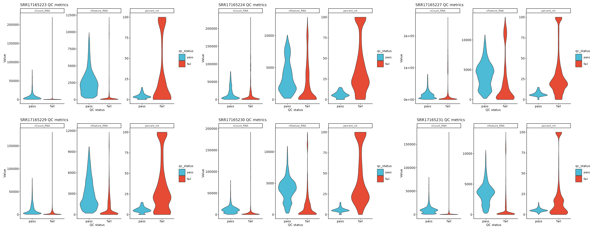
*Figure 1A | QC violin panel (SRR17165223, SRR17165224, SRR17165227, SRR17165229, SRR17165230, SRR17165231).* 

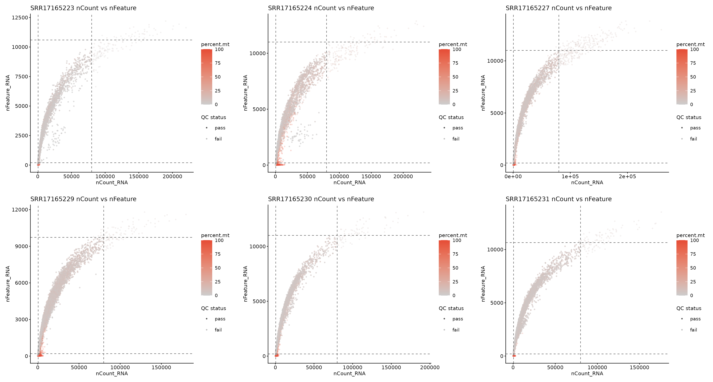
*Figure 2A | QC scatter panel.*

### Doublet detection

Doublet UMAPs indicate doublets are concentrated in high-expression regions, with rates within typical scRNA-seq ranges.

*Figure 3A | Doublet UMAP (Disease group).* 

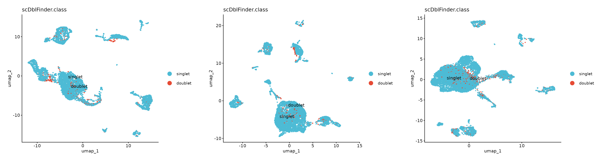
*Figure 3B | Doublet UMAP (Control group).*

### Clustering and SingleR annotation

Clusters are well defined in all samples, and SingleR labels provide a consistent reference for manual annotation.

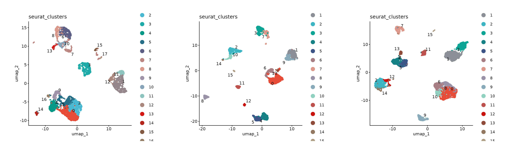
*Figure 4A | Cluster UMAP (Disease group).* 

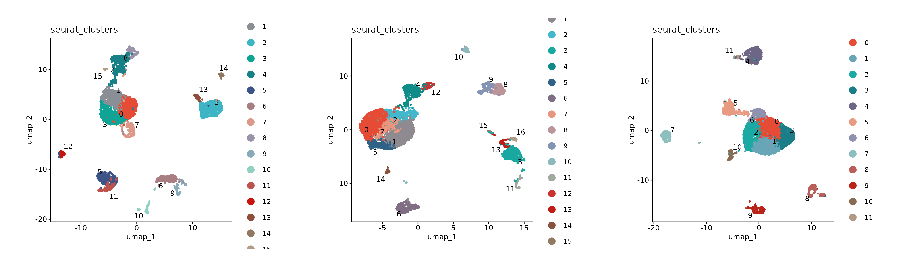
*Figure 4B | Cluster UMAP (Control group).*

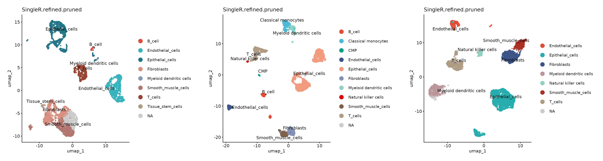
*Figure 5A | SingleR UMAP (Disease group).* 

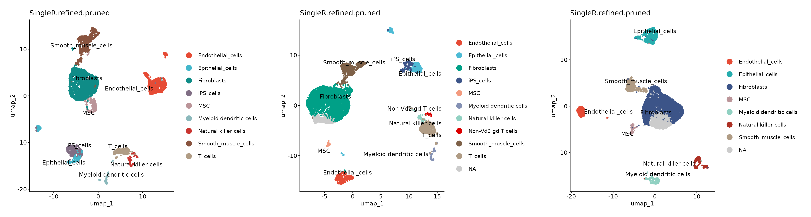
*Figure 5B | SingleR UMAP (Control group).*

### Manual annotation evidence

Manual annotation relied on canonical marker panels for immune lineages, endothelial/stromal cells, epithelial cells, and cycling cells. FeaturePlot, DotPlot, and heatmaps support the spatial distribution and expression patterns of major cell types.

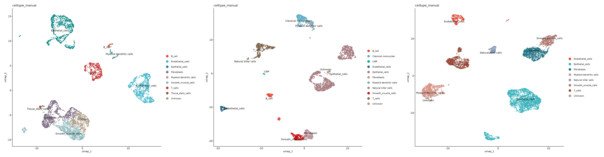
*Figure 6A | Manual annotation UMAP (Disease group).* 

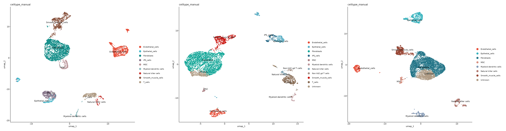
*Figure 6B | Manual annotation UMAP (Control group).*

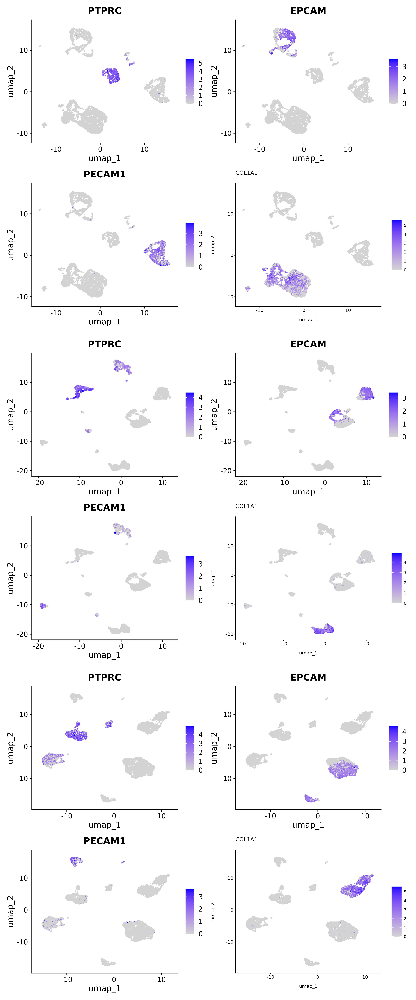
*Figure 7A | Lineage marker FeaturePlot (Disease group).* 

*Figure 7B | Lineage marker FeaturePlot (Control group).*

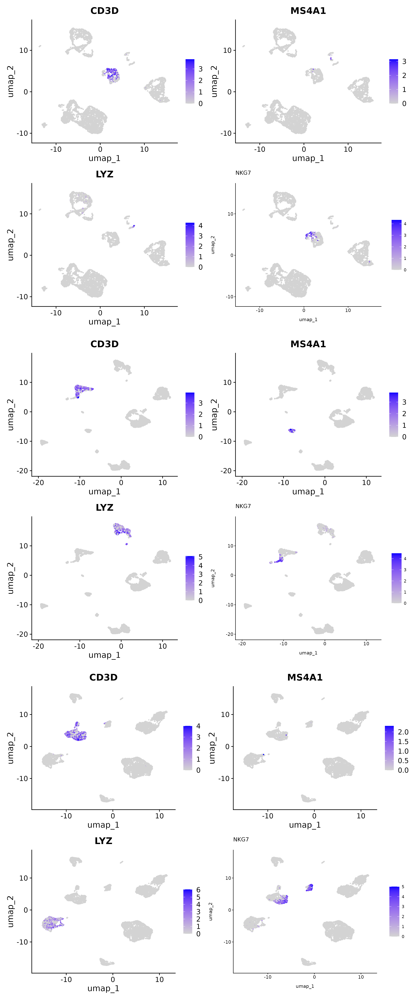
*Figure 8A | Immune marker FeaturePlot (Disease group).* 

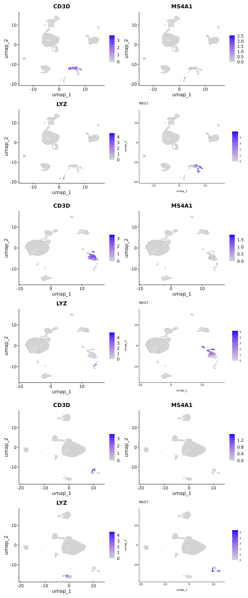
*Figure 8B | Immune marker FeaturePlot (Control group).*

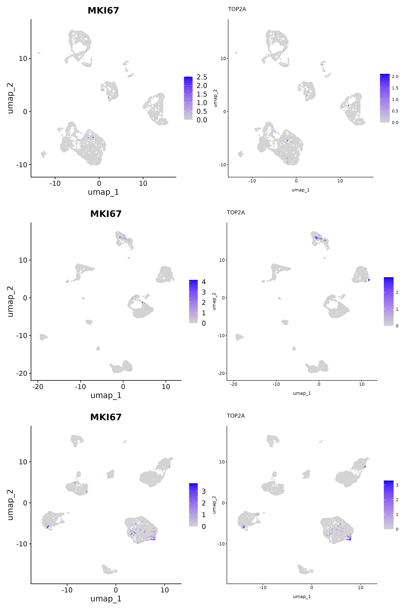
*Figure 9A | Cell-cycle marker FeaturePlot (Disease group).* 

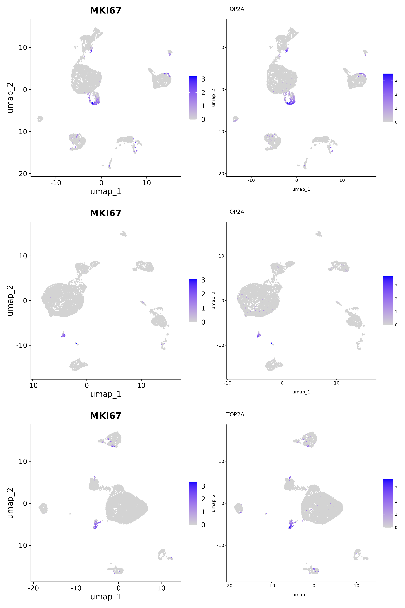
*Figure 9B | Cell-cycle marker FeaturePlot (Control group).*

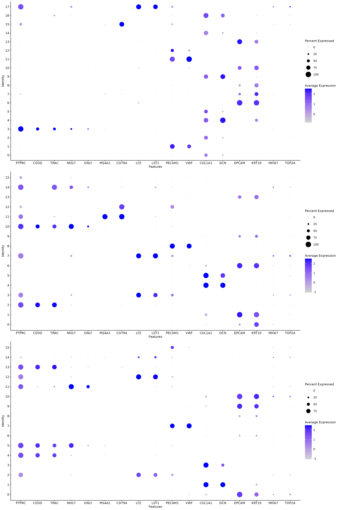
*Figure 10A | Marker DotPlot (Disease group).* 

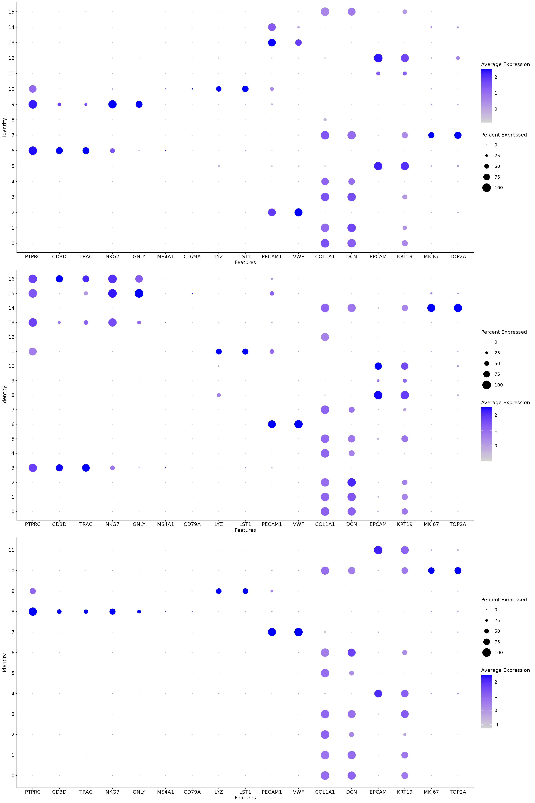
*Figure 10B | Marker DotPlot (Control group).*

*Figure 11A | Cluster top-marker heatmap (Disease group).* 

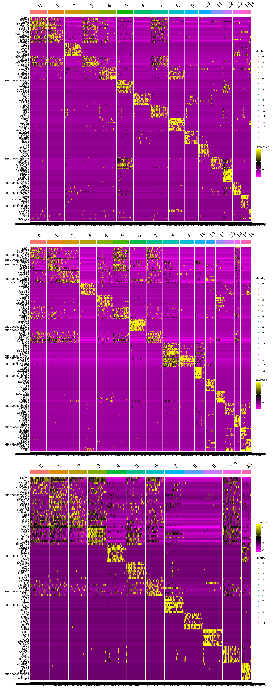
*Figure 11B | Cluster top-marker heatmap (Control group).*

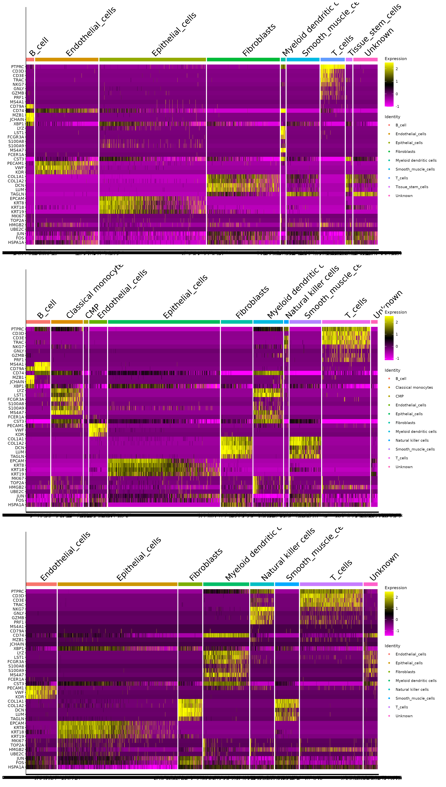
*Figure 12A | Cell-type marker-panel heatmap (Disease group).* 

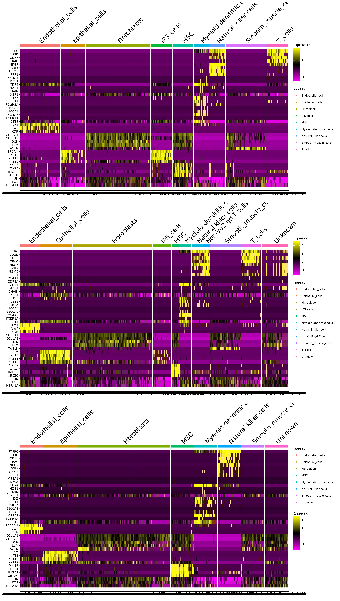
*Figure 12B | Cell-type marker-panel heatmap (Control group).*

### Cell-type composition and group-level differences

Cell-type composition plots show that Disease samples are enriched for epithelial cells, while Control samples are dominated by fibroblasts. Immune-related populations are proportionally higher in Disease, consistent with a more inflamed tumor microenvironment.

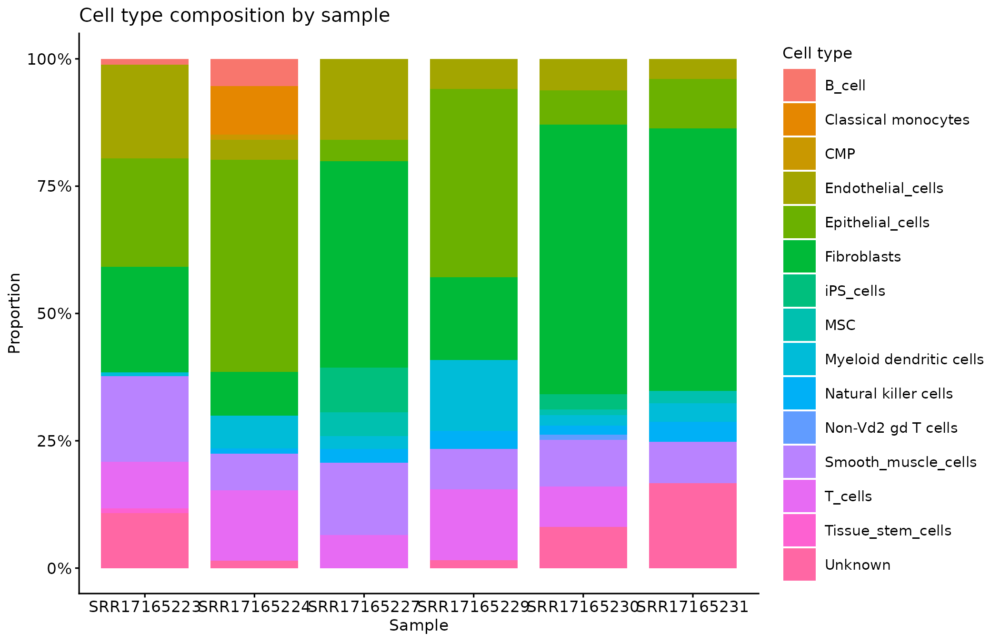
*Figure 13A | Cell-type composition by sample.* 

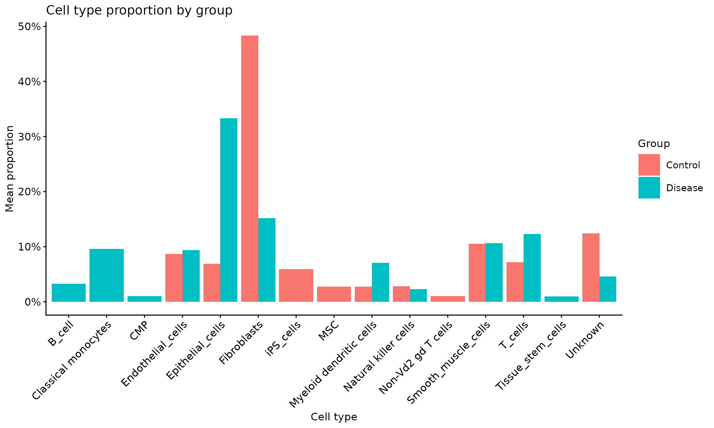
*Figure 13B | Cell-type composition by group.*

Table 2. Mean cell-type proportions by group (%).

| celltype | Control | Disease |
| --- | --- | --- |
| Fibroblasts | 48.3 | 15.2 |
| Epithelial_cells | 6.9 | 33.3 |
| Unknown | 12.4 | 4.6 |
| T_cells | 7.2 | 12.3 |
| Smooth_muscle_cells | 10.5 | 10.6 |
| Classical monocytes | 0.0 | 9.6 |
| Endothelial_cells | 8.7 | 9.4 |
| Myeloid dendritic cells | 2.7 | 7.1 |
| iPS_cells | 5.9 | 0.0 |
| B_cell | 0.0 | 3.3 |
| Natural killer cells | 2.8 | 2.3 |
| MSC | 2.7 | 0.0 |
| CMP | 0.0 | 1.0 |
| Non-Vd2 gd T cells | 1.0 | 0.0 |
| Tissue_stem_cells | 0.0 | 1.0 |

## Interpretation and Limitations

The unified QC thresholds improved comparability across samples, and the Isec intersection ensured consistent barcode definitions. However, differences in sequencing depth still influence UMI and gene-count distributions. Doublet rates varied across samples, suggesting variability in sample preparation or loading. Manual annotation retained some uncertain labels (e.g., Unknown), likely reflecting reference limitations or mixed clusters; further refinement with literature markers and differential expression is warranted.

Integration and differential expression analyses have not been performed, so statistical significance of group differences remains to be tested. Cell Ranger web_summary files are preserved as HTML, and if screenshots are required for the course they should be added manually. Overall, the pipeline delivers a complete end-to-end analysis with a validated annotation evidence chain. The observed enrichment of epithelial cells in Disease and fibroblasts in Control provides a clear biological signal and a foundation for downstream integration and DE analyses.

## Appendix: Full QC summary table

Table A1. QC summary table (full metrics, source `analysis/Table1_QC_SPEC2.tsv`).

| sample_id | group | cellranger_cells | qc_pass_cells | scdbl_singlets | scdbl_doublets | scdbl_doublet_rate_pct | cellbender_cells | isec_cells | nCount_RNA_median | nCount_RNA_IQR | nFeature_RNA_median | nFeature_RNA_IQR | percent_mt_median | percent_mt_IQR |
| --- | --- | --- | --- | --- | --- | --- | --- | --- | --- | --- | --- | --- | --- | --- |
| SRR17165223 | Disease | 8693 | 6556 | 5997 | 559 | 8.527 | 8598 | 5759 | 5390 | 7110.5 | 2239 | 2026.5 | 3.851 | 3.758 |
| SRR17165224 | Disease | 4977 | 3151 | 2991 | 160 | 5.078 | 5418 | 2893 | 8375 | 21302.0 | 2929 | 3430.0 | 5.724 | 4.815 |
| SRR17165227 | Control | 8071 | 6424 | 5854 | 570 | 8.873 | 8268 | 5747 | 11652 | 13483.0 | 4057 | 3088.0 | 6.3 | 3.521 |
| SRR17165229 | Disease | 12470 | 8959 | 8055 | 904 | 10.09 | 13496 | 7665 | 5614 | 11778.0 | 2380 | 2748.0 | 5.477 | 3.789 |
| SRR17165230 | Control | 8079 | 6903 | 6261 | 642 | 9.3 | 8494 | 6085 | 10609 | 8517.0 | 3980 | 2147.0 | 5.459 | 2.678 |
| SRR17165231 | Control | 11869 | 11468 | 9850 | 1618 | 14.109 | 12888 | 9321 | 8655 | 7518.0 | 3394 | 1904.0 | 5.138 | 2.37 |
